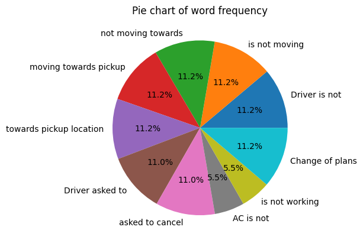

# Exploratory Data Analysis on Uber dataset(2024)

This comprehensive dataset contains detailed ride-sharing data from Uber operations for the year 2024, providing rich insights into booking patterns, vehicle performance, revenue streams, cancellation behaviors, and customer satisfaction metrics.

Data source: [https://www.kaggle.com/datasets/yashdevladdha/uber-ride-analytics-dashboard?select=ncr_ride_bookings.csv](https://www.kaggle.com/datasets/yashdevladdha/uber-ride-analytics-dashboard?select=ncr_ride_bookings.csv)

### Dataset overview

- 150000 dataset with 21 columns 
- Columns: Date, Time, Booking ID, Booking Status, Customer ID,Vehicle Type, Pickup Location, Drop Location, Avg VTAT,Avg CTAT, Cancelled Rides by Customer,Reason for cancelling by Customer, Cancelled Rides by Driver,Driver Cancellation Reason, Incomplete Rides,Incomplete Rides Reason, Booking Value, Ride Distance,Driver Ratings, Customer Rating, Payment Method

### Objectives 
- Understanding about the customer behaviour
- Understanding about the driver behaviour 
- Reasons for incomplete ride 

### Analysis on Ride cancel by customer columns
+ 10500 rides are cancel by customers

#### Words frequency

- Driver is not:2335
- is not moving:2335
- not moving towards:2335
- moving towards pickup:2335
- towards pickup location:2335
- Driver asked to:2295
- asked to cancel:2295
- AC is not:1155
- is not working:1155
- Change of plans:2353

#### Visualization
Piechart representation of word frequency
<!--  -->

#### Conclusion
+ Rides are cancel by customer because of driver's aren't moving towards the right direction
+ Driver him/herself asking for cancelation of ride 
+ Change in plan of customer
+ Ac not working also lead towards the cancelation of ride 

### Analysis on Ride cancel by Driver columns
+ 27000 rides are cancel by riders

#### Words frequency:
- & Car related': 6726
- Car related issues: 6726
- Customer related issue: 6837
- More than permitte: 6686
- Personal & Car': 6726
- The customer was: 675
- customer was coughing/sick: 6751
- people in there: 6686
- permitted people in: 6686
- than permitted people: 6686

#### Conclusion
+ Issue in vehicles leads to the cancelation of ride by driver.
+ Health issue of customer also cause the cancelation of ride by driver. 
+ More people in place then permitted 

### Analysis on Incomplete rides and Reasons
+ 9000 rides where incomplete

#### Incomplete Rides Reason
+ Customer Demand:3040
+ Vehicle Breakdown:3012
+ Other Issue:2948

